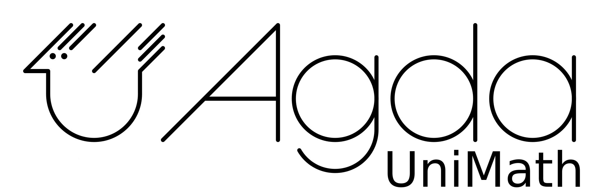

# Univalent mathematics in Agda

[](https://github.com/UniMath/agda-unimath/actions/workflows/ci.yaml) [](https://github.com/UniMath/agda-unimath/actions/workflows/pages.yaml)

Welcome to the website of the `agda-unimath` formalization project!

<a href="https://github.com/unimath/agda-unimath">

</a>

The `agda-unimath` library is a community formalisation project for univalent
mathematics in [Agda](https://github.com/agda/agda). The library project was
created by Elisabeth Bonnevier, Jonathan Prieto-Cubides, and Egbert Rijke. Our
goal is to formalize an extensive curriculum of mathematics from the univalent
point of view. Furthermore, we think libraries of formalized mathematics have
the potential to be useful, and informative resources for mathematicians. Our
library is designed to work towards this goal, and we welcome contributions to
the library about any topic in mathematics.

The library is built in Agda 2.6.3. It can be compiled by running `make check` from the main folder of the repository.

See the list of all Agda modules [here](everything.html).

## Joining the project

Great, you want to contribute something! The best way to start is to find us in our chat channels on the [Univalent Agda discord](https://discord.gg/Zp2e8hYsuX), which is a discord servers shared between the 1Lab, cubical Agda, and agda-unimath. We have a vibing community there, and you're more than welcome to join us just to hang out.

Once you've decided what you want to contribute, the best way to proceed is to make your own fork of the library. Within your fork, make a separate branch in which you will be making your contributions. Now you're ready to start your project! When you've completed your formalization you can proceed by making a pull request. Then we will review your contributions, and merge it when it is ready for the `agda-unimath` library.

## Citing the Agda-UniMath library

```md
{{#include CITATION.cff}}
```

{{#include SUMMARY.md}}

{{#include CONTRIBUTORS.md}}
